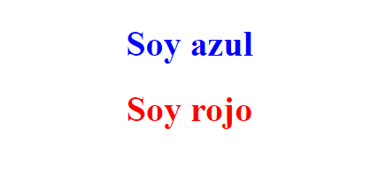
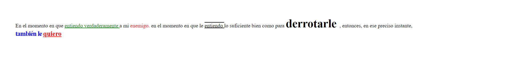
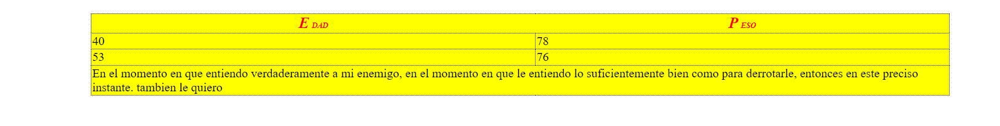

<h1>Taller 5: Saúl Guerrero</h1>

<h2>Información</h2>

Curso: Full Stack Intermedio

Profesor: Andres Pineda 

Estudiante: Saúl Guerrero

<h2>Punto 1: link de figma</h2>
<a href="https://www.figma.com/file/6Jl5zDg5be6NVwnPxD5oIT/FullStack-V2?type=design&node-id=0%3A1&mode=design&t=PBqY35nAt6dqLetL-1">Link de figma</a>
<embed src="./public/doc/FullStackV2.pdf" type="application/pdf" width="100%" height="600px" />
 
<a href="https://github.com/Saul-Guerrero/T5interFull/">Link pagina</a>

<h2>Punto 3: interfaz web </h2>
<embed sr>interfax</embed>

<h2>Punto 4: html y CSS </h2>

<h2>Punto 5: html y CSS </h2>

<h2>Punto 6: html y CSS </h2>

<h2>Punto 7: html y CSS </h2>

<h2>Punto 8: html y CSS </h2>
 

